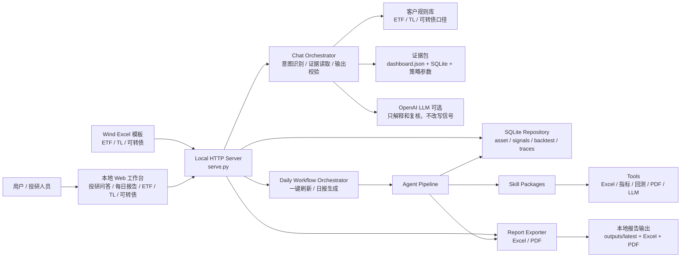
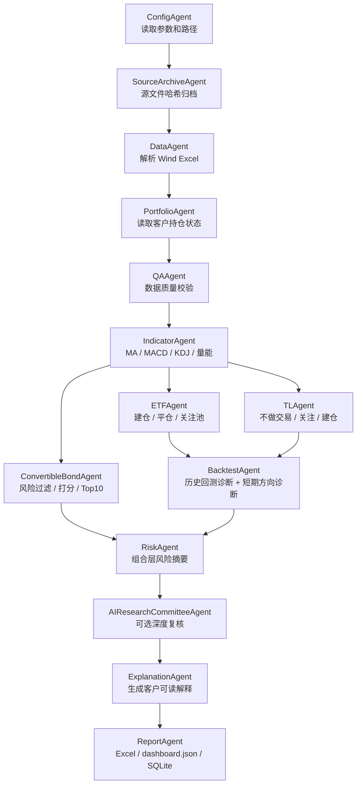
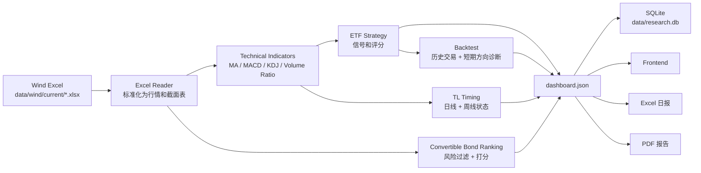

# AI Investment Research System

一个本地优先、规则可审计、AI 负责解释和复核的投研工作台。系统面向日频投研流程，当前覆盖 ETF、30 年国债期货 TL、可转债三类资产，并支持 Wind Excel 模板接入、本地 SQLite 存档、策略信号、数据质检、回测诊断、PDF/Excel 日报和投研问答。

> 重要声明：本项目只提供投研辅助、规则复核和数据分析能力，不构成任何投资建议或收益承诺。所有买入、卖出、建仓、平仓文字均来自确定性规则结果，AI 不允许新增标的、改写信号或承诺收益。

## 核心能力

- **ETF 日频策略**
  - 读取 Wind 导出的 ETF 日频行情和客户持仓状态。
  - 输出建仓候选、平仓提示、关注池和全量信号表。
  - 建仓条件围绕 MA5/MA10、MACD、前 60 日量能倍数。
  - 平仓条件围绕跌破 MA5/MA10 与放量确认。
  - 支持完整交易生命周期历史诊断，以及最近 30 个交易日“短期方向诊断”。

- **TL 日频择时**
  - 读取 30 年国债期货 TL 日频行情。
  - 按客户规则计算日线/周线 MACD 柱变化和 KDJ 低位反弹。
  - 输出“不做交易 / 关注交易 / 模型触发建仓候选 / 中性”状态。
  - 当前第一版只做状态诊断，不模拟 TL 平仓收益。

- **可转债筛选与打分**
  - 读取最新版可转债 v2 模板。
  - 先做风险过滤，再做综合打分和行业分散。
  - 风险维度包含价格、强赎、赎回公告、不强赎公告、评级、YTM、正股 ST、剩余规模、基本面增长稳定性等。
  - 输出 Top10、候选池全量排序、风险提示和评分依据。

- **AI 投研问答**
  - 可查询日报、数据库、策略参数、ETF/TL/可转债信号、数据质量、运行审计。
  - 本地确定性规则优先，LLM 只做解释层。
  - 支持 OpenAI API，可在 API 超时或不可用时降级为本地确定性回答。

- **本地数据库**
  - 使用 SQLite + WAL 模式。
  - 存储日报、资产档案、行情指标、ETF/TL 信号、可转债快照、回测摘要、运行审计、聊天 trace。
  - 适合单客户、本地 Mac 或小型服务器部署。

## 三大板块模型文档

系统当前按三个资产板块组织：ETF、TL、可转债。每个板块都有独立的判断规则、模型结构、公式口径和输出字段说明。

| 板块 | 文档 | 当前模型定位 | 核心输出 |
| --- | --- | --- | --- |
| ETF | [ETF 判断逻辑、模型与公式](docs/ETF_MODEL.md) | 日频规则模型，围绕 MA5/MA10、MACD、前 60 日量能和客户持仓状态生成信号 | 建仓候选、平仓提示、关注池、短期方向诊断、完整交易历史诊断 |
| TL | [TL 判断逻辑、模型与公式](docs/TL_MODEL.md) | 30 年国债期货 TL 日频状态诊断，围绕周线/日线 MACD 柱变化和 KDJ 低位反弹 | 不做交易、关注交易、模型触发建仓候选、中性 |
| 可转债 | [可转债判断逻辑、模型与公式](docs/CONVERTIBLE_BOND_MODEL.md) | 先风险过滤再综合打分，重点纳入强赎、信用、YTM、溢价率、基本面增长和行业分散 | Top10、候选池全量排序、风险提示、评分依据 |

> 三个板块均为确定性规则模型。AI 只读取这些规则和系统证据进行解释、复核和问答，不直接产生交易信号。

## 稳定交付文档

- [交付加固说明](docs/DELIVERY_HARDENING.md)
- [Dashboard 稳定数据契约](docs/DASHBOARD_SCHEMA.md)
- [报告话术与合规口径](docs/REPORTING_POLICY.md)
- [数据质量规则](docs/DATA_QUALITY_RULES.md)
- [稳定性交付检查表](docs/STABILITY_CHECKLIST.md)

## 产品界面

前端是一个本地 Web 工作台，默认入口：

```text
http://127.0.0.1:8766/frontend/
```

主要页面：

- **投研问答**：和 AI 交互，读取当前所有日报、信号、参数和数据库上下文。
- **每日报告**：今日结论、关键 KPI、直达入口、复核意见。
- **ETF**：ETF 建仓候选、平仓提示、关注池、近 30 交易日短期方向诊断、完整交易历史诊断。
- **TL**：TL 今日状态、近期状态、历史状态诊断。
- **可转债**：Top10、候选池全量排序、可转债质检与风险。
- **标的档案**：查询 ETF、TL、可转债详情。没有进入当前候选池的转债会明确显示原因，不再空白。
- **数据状态**：数据库、源文件、数据质检、组合风控。
- **运行审计**：每个 Agent 的输入、输出、状态和耗时。
- **策略参数**：可视化修改 ETF/TL/可转债策略参数。

## 架构设计

系统采用 `Agent -> Skill -> Tool` 的可审计结构。

### 系统总览图



### 日更工作流



### 数据流



### 代码结构图

```text
Frontend
  └── Local HTTP Server
        ├── Chat Orchestrator
        ├── Daily Workflow Orchestrator
        ├── SQLite Repository
        └── Report Exporter

Daily Workflow
  ├── ConfigAgent
  ├── SourceArchiveAgent
  ├── DataAgent
  ├── PortfolioAgent
  ├── QAAgent
  ├── IndicatorAgent
  ├── ETFAgent
  ├── TLAgent
  ├── ConvertibleBondAgent
  ├── BacktestAgent
  ├── RiskAgent
  ├── AIResearchCommitteeAgent
  ├── ExplanationAgent
  └── ReportAgent
```

Dashboard 固定输出契约：

```text
run_info
data_quality
etf
tl
convertible_bond
report_summary
```

### Agent

Agent 是业务角色，负责声明：

- 需要哪些输入 artifact。
- 产出哪些结果 artifact。
- 有哪些质量门。
- 是否允许调用 LLM。
- 在审计日志里如何记录。

### Skill

Skill 是专业能力包。每个 Skill 都包含：

- `SKILL.md`：能力说明和输入输出合同。
- `handler.py`：确定性实现逻辑。

### Tool

Tool 是底层工具层，例如：

- Excel 读取和写入。
- PDF 生成。
- SQLite 入库。
- OpenAI API 调用。
- 文本清洗与输出校验。

## 策略口径

### ETF

建仓信号：

- T 日收盘后判断。
- MA5 上穿 MA10。
- MACD 柱改善。
- 前 60 日均量倍数达到阈值，默认 `1.1`。
- MA5 高于 MA20 是增强项，不是硬条件。
- MACD 金叉可作为另一类触发，但仍需趋势和量能配合。

平仓信号：

- T 日收盘后判断。
- 收盘价跌破 MA10 且量能倍数达到默认 `1.2`。
- 或收盘价跌破 MA5 且量能倍数达到默认 `1.5`。
- 只有客户状态为持仓时才输出平仓提示。

回测口径：

- 不偷看未来。
- T 日收盘后产生信号。
- T+1 开盘价模拟成交。
- 完整交易回测统计持仓周期收益、胜率、平均收益、最差收益。
- 短期方向诊断统计 T+1 开盘到收盘方向是否符合预期。

### TL

周线规则：

- 红柱 T 日短于 T-1 日、绿柱 T 日长于 T-1 日、红转绿阶段：不做交易。
- 红柱 T 日长于 T-1 日、绿柱 T 日短于 T-1 日、绿转红阶段：开始关注。
- 周线近 2 周 J 值低点小于 20 且 T 周 J 值反弹，满足周线 KDJ 低位反弹。

日线规则：

- 日线 MACD 改善作为关注条件。
- 日线近 3 日 J 值低点小于 5 且 T 日 J 值反弹，满足日线 KDJ 低位反弹。

输出状态：

- `不做交易`
- `关注交易`
- `模型触发建仓候选`
- `中性`

### 可转债

流程是：

```text
风险识别 -> 硬过滤 -> 分项打分 -> 风险扣分 -> 行业分散 -> Top10
```

硬过滤可配置项包括：

- 价格低于最低价，默认 100。
- 价格高于上限，默认 140。
- 已发赎回公告。
- 触发强赎价且未见有效不强赎公告，默认硬排除。
- 高 YTM 异常。
- 严重负 YTM。
- 低评级。
- 正股 ST。
- 剩余规模过低。
- 高转股溢价率硬排除。

评分维度：

- 基本面增长。
- 转股溢价率。
- 到期收益率质量。
- 剩余期限。
- 信用评级。
- 强赎状态。
- 剩余规模。

## 数据输入

客户侧通过 Wind Excel 刷新数据。系统默认读取：

```text
data/wind/current/01_ETF清单和日频公式.xlsx
data/wind/current/02_TL日频公式.xlsx
data/wind/current/03_可转债数据.xlsx
```

这些真实客户数据不会提交到 GitHub。仓库只保留模板：

```text
templates/客户模板拆分版/01_ETF清单和日频公式.xlsx
templates/客户模板拆分版/02_TL日频公式.xlsx
templates/客户模板拆分版/03_可转债数据.xlsx
```

## 快速开始

### 1. 安装依赖

建议 Python 3.12。

```bash
python -m venv .venv
source .venv/bin/activate
pip install -e .
```

如果本地没有安装 Excel/PDF 相关依赖，请安装：

```bash
pip install pandas numpy openpyxl xlsxwriter reportlab
```

### 2. 准备数据

把客户从 Wind 刷新的三个 Excel 放到：

```text
data/wind/current/
```

文件名应与 `configs/data_sources.json` 保持一致。

### 3. 配置 OpenAI API，可选

复制环境变量示例：

```bash
cp .env.example .env
```

填入：

```bash
OPENAI_API_KEY=sk-your-key-here
```

没有 API key 时，系统仍可运行，交易信号、数据质检、回测、日报结构都会正常生成；AI 解释会自动降级为本地确定性模板。

### 4. 启动本地服务

```bash
python serve.py --port 8766
```

打开：

```text
http://127.0.0.1:8766/frontend/
```

### 5. 手动跑日报

也可以不用前端，直接运行：

```bash
PYTHONPATH=backend python -m superpower.cli.run_daily \
  --etf-file data/wind/current/01_ETF清单和日频公式.xlsx \
  --tl-file data/wind/current/02_TL日频公式.xlsx \
  --cb-file data/wind/current/03_可转债数据.xlsx \
  --disable-llm
```

输出文件：

```text
outputs/latest/dashboard.json
outputs/latest/audit.json
outputs/AI投研日报-Superpower-YYYYMMDD.xlsx
outputs/AI投研日报-Superpower-YYYYMMDD.pdf
data/research.db
logs/agent_audit_<run_id>.jsonl
```

默认情况下，独立 QA audit 如果不是 PASS，不会阻断日报生成；结果会写入 `outputs/latest/audit.json` 和 `dashboard.run_info.warnings`。如果需要 CI/交付闸门严格失败，可追加：

```bash
--strict-audit
```

## 配置文件

```text
configs/
  data_sources.json       # Wind Excel 数据路径
  strategy_params.json    # ETF/TL/可转债策略参数
  model_config.json       # LLM 开关、模型和调用策略
  positions.csv           # 客户持仓状态
  universe_etf.json       # ETF 覆盖范围
  delivery.json           # 报告交付配置
```

## 项目目录

```text
backend/superpower/
  agents/                 # Agent 编排节点
  audit/                  # 独立日报审计
  chat/                   # 投研问答、路由、证据包、输出校验
  cli/                    # 日报命令行入口
  db/                     # SQLite schema、ingest、repository
  runtime/                # Agent runtime、Skill registry、artifact context
  server/                 # 本地 HTTP 服务
  skills/                 # 专业 Skill 包
  tools/                  # Excel/PDF/LLM/文本工具

frontend/
  index.html              # 本地工作台
  assets/app.js           # 前端交互和渲染
  assets/styles.css       # 黑白 Apple/OpenAI 风格 UI

docs/                     # 架构、数据契约、策略参数、客户说明
templates/                # Wind 客户模板
tests/                    # 冒烟测试和商业组件测试
```

## 安全与隐私

以下内容不会提交到仓库：

- `.env` 和 API key。
- `data/research.db`。
- `data/db_backups/`。
- `data/wind/current/*.xlsx` 真实客户数据。
- `outputs/` 生成报告。
- `logs/` 运行日志。

如需共享样例数据，请单独制作脱敏样本，不要直接提交客户原始 Excel。

## 测试

```bash
python -m compileall backend/superpower
pytest
python tests/smoke.py
```

如果已经准备好本地数据，也可以通过前端点击“一键刷新”或运行 `run_daily` 进行端到端验证。

## 当前边界

- ETF 覆盖池数量取决于客户 Excel 当前纳入标的。
- TL 当前为日频版本，60 分钟频率暂未实现。
- TL 第一版只做状态诊断，不模拟收益。
- 可转债当前是单日截面打分，若要正式回测，需要历史每日可转债截面。
- 新闻、公告、宏观数据尚未作为正式数据源接入。
- 本项目不承诺策略收益，回测仅为历史诊断，不代表未来收益。

## Roadmap

- ETF 组合级资金曲线、最大回撤、年化收益和 Sharpe。
- TL 建仓后平仓规则与收益回测。
- 可转债历史截面回测。
- 公告、新闻、宏观利率和行业事件接入。
- Mac launchd 定时任务。
- 邮件、企业微信或飞书日报推送。
- 参数变更记录和版本化报告归档。
